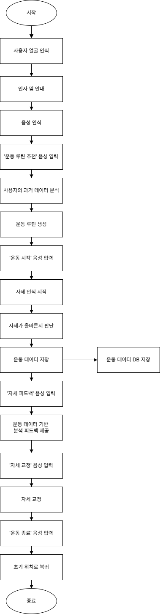

# 🤖 재활 보조 및 운동 자세 교정 로봇 (Rehab Assist Robot)

이 프로젝트는 ROS 2 Humble 환경에서 구동되는 **두산 M0609 협동 로봇 기반의 재활 및 운동 보조 시스템**입니다.
YOLOv11을 활용한 실시간 자세 인식(Pose Tracking)과 안면 인식 기능을 통해 사용자를 식별하고, 사레레(사이드 레터럴 레이즈), 숄더프레스 등의 운동 자세를 분석하여 로봇이 알맞은 교정 동작과 음성 안내를 제공합니다.

---

## 📌 주요 기능 (Key Features)

* **💪 실시간 자세 인식 및 운동 교정 (Pose Tracking & Correction)**
    * **탐지:** `yolo11n-pose.pt` 모델을 활용하여 사용자의 관절 포인트를 실시간으로 추적합니다.
    * **평가:** 사레레, 숄더프레스 등의 운동 수행 시 올바른 궤적과 자세인지 분석합니다.
    * **제어:** 자세 교정 완료 시 음성 안내와 함께 로봇이 초기 위치(init_pos)로 안전하게 복귀합니다.

* **👤 사용자 맞춤형 안면 인식 및 DB 연동 (Face Recognition & DB)**
    * **탐지:** 프로그램 시작 시 사용자 얼굴을 인식하여 개인 프로필을 식별합니다.
    * **관리:** Firebase 기반의 2차 통합 DB 및 UI 노드를 통해 개인별 운동 기록과 시스템 상태를 실시간으로 저장하고 시각화합니다.

* **🗣️ 음성 처리 및 상호작용 (Voice Processing)**
    * 운동 피드백과 로봇의 현재 상태를 사용자에게 직관적인 음성으로 안내합니다.

---

## 🛠️ 시스템 설계 (System Architecture)

본 시스템은 다중 PC 분산 통신(DDS) 구조를 채택하여 Perception(인식), Decision(판단), Control(제어)의 부하를 효율적으로 분산 처리합니다.

### 🌐 ROS 2 노드 통신 구조 (Node Architecture)


각 핵심 노드(Node)의 역할과 데이터 흐름은 다음과 같습니다.

1. **`VoiceAssistant` (메인 허브):** 전체 시스템의 관제탑 역할을 합니다. 사용자의 음성 명령과 얼굴 인식 결과를 수합하여 `SystemController`로 제어 명령(`/system_command`)을 하달하고, `ExercisePlanner`와 통신하여 맞춤형 루틴을 계획합니다.
2. **`FaceRecognition`:** 카메라를 통해 사용자를 식별하고, 식별된 유저 정보(`/recognized_user`)를 방송합니다.
3. **`SystemController`:** 허브로부터 명령을 받아 로봇의 운동 상태(`/set_exercise_state`)를 설정하고, 교정이 필요할 시 목표 3D 좌표(`/publish_target_3d`)를 계산해 냅니다.
4. **`PostureAnalyzer` & `PostureCorrector`:** 실시간으로 관절 데이터를 분석하여 운동 결과를 도출(`/exercise_result`)하며, 잘못된 자세가 감지되면 로봇 암을 직접 제어하여 물리적인 교정을 수행합니다.
5. **`UserInterface`:** 최종 분석된 운동 결과와 시스템 상태를 수신하여 Firebase 클라우드 DB에 전송하고, 웹 기반 UI에 실시간으로 렌더링합니다.

---

## 🔄 알고리즘 플로우 차트 (Logic Flow)



---

## 💻 개발 환경 (Environment)

* **OS:** Ubuntu 22.04 LTS (Jammy Jellyfish)
* **Middleware:** ROS 2 Humble Hawksbill
* **Language:** Python 3.10, HTML/JS/CSS (Web UI)
* **Key Libraries:** `rclpy`, `ultralytics` (YOLO), `opencv-python`, `firebase-admin`

---

## ⚙️ 사용 장비 (Hardware Setup)

본 프로젝트는 노인 재활 보조를 위한 안전한 환경 구축 및 원활한 데이터 처리를 위해 다중 PC 환경(Main + UI)으로 분산 구성되었습니다.

| 분류 (Component) | 장비명 (Type) | 상세 설명 (Spec / Description) |
| :--- | :--- | :--- |
| **Robot** | Doosan M0609 | 6축 협동 로봇 (가반하중 6kg) |
| **Vision 1** | Realsense Camera | Pose Tracking & Face Recognition |
| **Vision 2** | Realsense Camera | Pose Tracking |
| **Compute 1 (Main)**| MSI Katana 17 B13V | ROS 2 메인 컨트롤 및 딥러닝 비전 추론 |
| **Compute 2 (UI)** | Samsung 550XBE/330XBE | Firebase DB 연동 및 웹 UI 렌더링 서버 |
| **Audio** | Webcam | Voice Recognition (음성 인식 마이크) |

---

## 📦 의존성 설치 (Dependencies)

**1. ROS 2 패키지**
시스템 제어 및 노드 통신을 위해 아래의 패키지들이 요구됩니다.
* `rclpy`, `std_msgs`, `sensor_msgs`, `geometry_msgs`
* `cv_bridge`
* `od_msg` (Custom Message Package)

**2. Python 라이브러리**
YOLOv11 비전 처리 및 클라우드 연동을 위해 다음 패키지를 설치합니다.
```bash
pip install ultr 탁ytics opencv-python numpy firebase-admin openai python-dotenv

---
## 🚀 실행 순서 (How to Run)

1. 워크스페이스 생성 및 패키지 클론
mkdir -p ~/ros2_ws/src
cd ~/ros2_ws/src
git clone https://github.com/kwakmoonjung/rehab_assist_robot.git
2. 프로젝트 빌드
cd ~/ros2_ws
# 커스텀 메시지 패키지(od_msg) 우선 빌드
colcon build --packages-select od_msg
colcon build --packages-select rehab_assist_robot robot_control voice_processing object_detection
3. 메인 시스템 런치 (Terminal 1)
# (참고: ros_set은 'source /opt/ros/humble/setup.bash' 커스텀 alias입니다.)
ros_set
source install/setup.bash
ros2 launch rehab_assist_robot main_system.launch.py
4. 객체 및 자세 인식 노드 실행 (Terminal 2)
ros_set
source install/setup.bash
ros2 run object_detection pose_tracking_node
